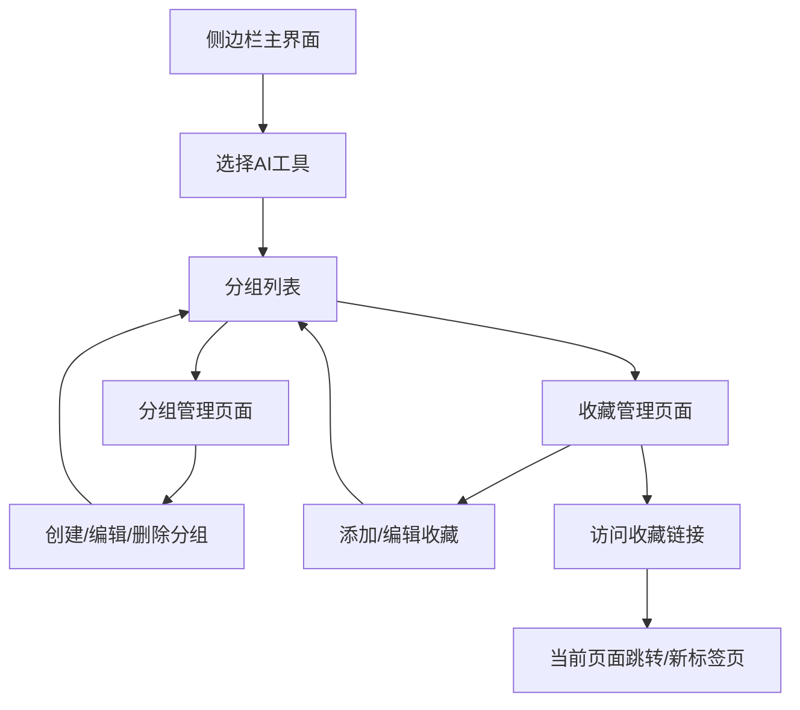

## 1. Product Overview
AI工具分组管理Chrome侧边栏插件，解决ChatGPT、Claude等AI工具缺乏对话分组功能的痛点，帮助用户更好地管理和组织AI对话记录。
- 主要解决问题：AI工具对话数量过多导致管理困难，缺乏有效的分组和收藏功能
- 目标用户：频繁使用多种AI工具的用户，特别是需要管理大量对话记录的专业用户
- 产品价值：提升AI工具使用效率，降低对话管理成本，填补现有AI工具功能空白

## 2. Core Features

### 2.1 User Roles
由于是本地存储的个人工具，不需要区分用户角色，所有功能对默认用户开放。

### 2.2 Feature Module
我们的AI工具分组管理插件包含以下核心页面：
1. **侧边栏主界面**：AI工具选择器、分组列表展示、快速操作按钮
2. **分组管理页面**：创建分组、重命名分组、删除分组、分组排序
3. **收藏管理页面**：添加收藏链接、编辑收藏信息、删除收藏项目

### 2.3 Page Details

| Page Name | Module Name | Feature description |
|-----------|-------------|---------------------|
| 侧边栏主界面 | AI工具选择器 | 支持ChatGPT、Claude、Gemini等主流AI工具切换，显示当前选中工具 |
| 侧边栏主界面 | 分组列表 | 展示当前AI工具下的所有分组，支持折叠展开，显示每个分组下的收藏数量 |
| 侧边栏主界面 | 快速操作 | 新建分组按钮、搜索功能、设置入口 |
| 分组管理页面 | 分组创建 | 输入分组名称，选择图标，创建新分组 |
| 分组管理页面 | 分组编辑 | 重命名分组、更换图标、调整分组顺序 |
| 分组管理页面 | 分组删除 | 删除分组及其下所有收藏项，提供确认提示 |
| 收藏管理页面 | 收藏添加 | 手动添加当前页面到指定分组，自动获取页面标题和URL |
| 收藏管理页面 | 收藏编辑 | 修改收藏标题、备注信息、移动到其他分组 |
| 收藏管理页面 | 收藏访问 | 点击直接跳转，Ctrl+点击新标签页打开 |

## 3. Core Process

**主要用户操作流程：**

1. **初次使用流程**：用户安装插件 → 打开侧边栏 → 选择AI工具类型 → 创建第一个分组 → 添加收藏链接

2. **日常使用流程**：打开侧边栏 → 选择对应AI工具 → 浏览分组列表 → 点击收藏项目访问对话

3. **管理操作流程**：选择分组 → 进入管理模式 → 添加/编辑/删除收藏 → 重命名/删除分组

## 4. User Interface Design

### 4.1 Design Style
- **主色调**：深色主题 #2D3748，浅色辅助 #F7FAFC
- **强调色**：蓝色 #3182CE，绿色 #38A169（成功），红色 #E53E3E（删除）
- **按钮样式**：圆角按钮，悬停效果，扁平化设计
- **字体**：系统默认字体，标题16px，正文14px，小字12px
- **布局风格**：卡片式布局，左侧导航，右侧内容区域
- **图标风格**：线性图标，统一风格，支持AI工具品牌色

### 4.2 Page Design Overview

| Page Name | Module Name | UI Elements |
|-----------|-------------|-------------|
| 侧边栏主界面 | AI工具选择器 | 水平标签页设计，显示AI工具图标和名称，当前选中状态高亮 |
| 侧边栏主界面 | 分组列表 | 垂直卡片布局，每个分组显示图标、名称、收藏数量，支持拖拽排序 |
| 侧边栏主界面 | 快速操作 | 固定在底部的操作栏，包含新建、搜索、设置按钮 |
| 分组管理页面 | 分组操作 | 模态框设计，表单输入，图标选择器，确认/取消按钮 |
| 收藏管理页面 | 收藏列表 | 列表式布局，显示网站图标、标题、URL，右侧操作按钮 |
| 收藏管理页面 | 收藏操作 | 悬浮操作菜单，编辑、删除、移动选项 |

### 4.3 Responsiveness
插件主要针对桌面端Chrome浏览器设计，侧边栏固定宽度320px，内容区域自适应高度，支持滚动浏览。